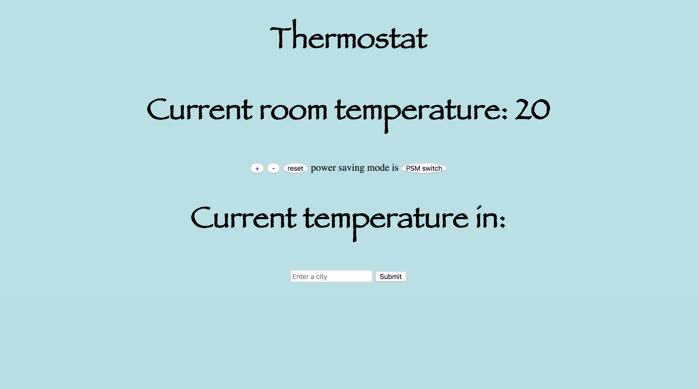

# Thermostat-

[Projects](#MVP) | [Skills](#Installation) | [Education](#Functionality) |



# Task

We needed to build a simple Thermostat.
This was a afternoon project during my time at Makers Academy.

# Installation

1. Fork this repoistory and clone  it to your local machine then change into the directory

```
$ git clone git@github.com:tobydawson1/Thermostat-js
$ cd Thermostat-js
```

2. Load dependencies with bundle:

```
$ gem install bundle
$ bundle
```

3. Run jasmine for tests and coverage

```
$ open SpecRunner.html
```

run the app on a local server and use on the browser: http://localhost:9292

```
$rackup
```


# Funtionality